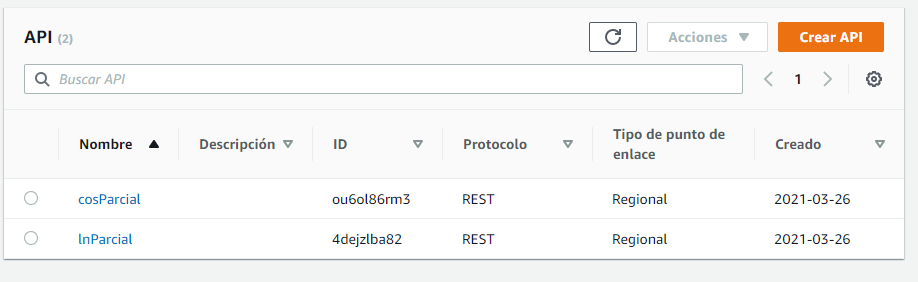
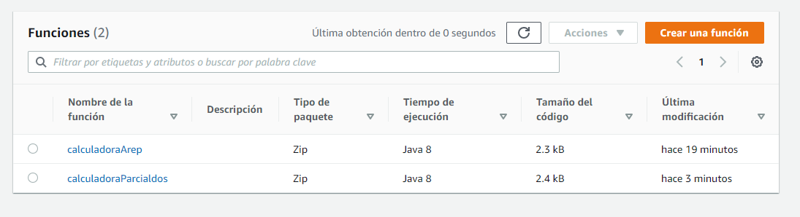

## AREP-2021 parcial lambda

En este parcial se despliegan dos funciones a AWS Lambda una es cos y otra ese ln

### Prerequisitos

- Maven: Esta es la herramienta encargada de la creacion del proyecto y ayuda a manejar la despedencias del mismo
- Git: Software de control de versiones.
- JDK: Es la herramienta que sirve para desarrollar en java, versiones de este programa desde la 8 en adelante.

### Funcionamiento 

La aplicacion quedo montada y funcionando en AWS con lambda y AWS gateway

### Licencia
GNU General Public License v3.0 

### Autor 

#### David Andres Herrera Moya 
